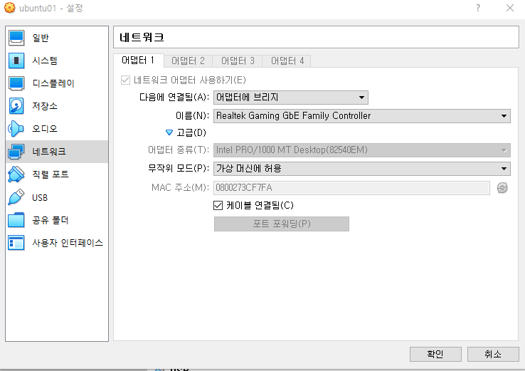

### ssh 서버 설치 확인

`sudo dpkg -l | grep ssh`

 

### 패키지 목록 업데이트

`sudo apt-get update`

 

### ssh 서버 설치

`sudo apt-get install openssh-server`

 

### ssh 서버 설치 확인

`sudo dpkg -l | grep ssh`

 

### vm 네트워크 설정 확인

